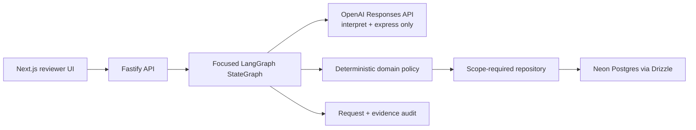
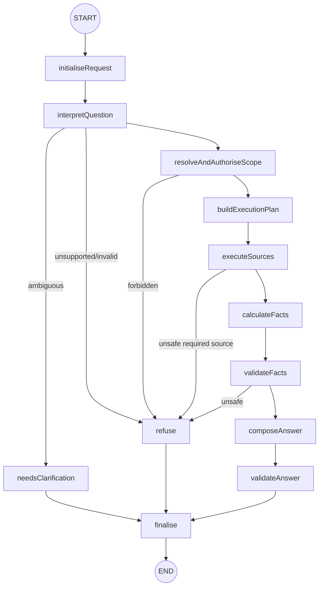
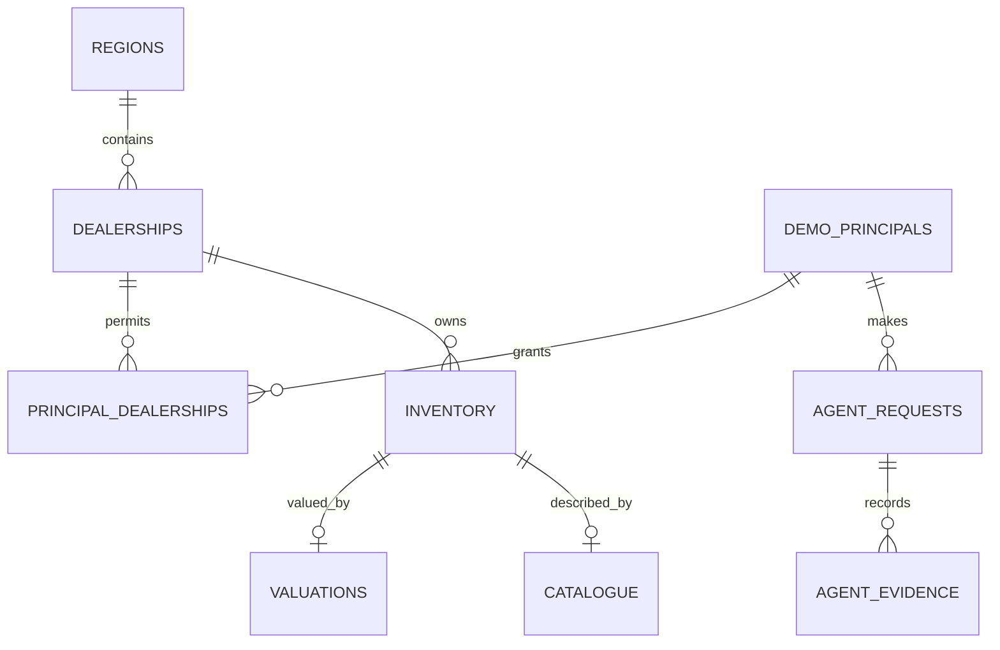

# Architecture

## Architecture approach

The POC uses a focused workflow rather than an open-ended tool loop. This keeps the experience fast and predictable while allowing the language model to do what it does well: understand dealership questions and explain verified results clearly.

OpenAI transforms a user question into approved enums and phrases a compact, validated fact bundle. TypeScript resolves IDs and permissions, selects sources, queries through scoped repositories, calculates values, evaluates freshness and invariants, issues evidence IDs, validates citations, enforces budgets and explains when a verified answer is not currently available.

## Graph

There is no intentional loop. Invocation uses a recursion limit of 16, a default eight-second overall deadline, at most two planner attempts, at most six source calls, and a 10,000-row ceiling per source. Adapters request one sentinel row beyond the ceiling and explain when a scope is too large for a complete result instead of silently truncating it. Independent inventory and valuation reads use `Promise.allSettled`; catalogue is deferred until fresh inventory supplies unique vehicle IDs, then queried once as a controlled batch.

## Request lifecycle

1. The API validates transport input with the shared Zod request schema and assigns a request ID.
2. `initialiseRequest` establishes the deadline and budgets.
3. `interpretQuestion` returns only supported intent/metric enums, human scope text, filters, and clarification state. It cannot return SQL, IDs, tools, or calculated values.
4. Scope text is resolved, intersected with the selected principal, and embedded in an `AuthorisedScope`. Expected denial stops before source access.
5. Code maps intent to a fixed execution plan. Every repository method requires authorised scope; valuation/catalogue joins reapply its dealership predicate.
6. Adapters return source identity, oldest `sourceTime`, `fetchedAt`, freshness, count, row-budget overflow, and safe error metadata. Demo faults exist only at this boundary.
7. Required-source availability, freshness, and row budgets are validated immediately. When these checks do not pass, the workflow explains why a verified answer is not currently available before catalogue fan-out or analytics.
8. Analytics creates metrics, facts, and stable request-local evidence IDs. Zero denominators are excluded, and ties sort alphabetically after the primary ranking.
9. Fact validation checks numeric invariants and evidence coverage. Results that do not pass these checks are not presented as verified insights.
10. Only compact facts/evidence/freshness reach the answer model. Unknown answer evidence IDs trigger a deterministic replacement.
11. `finalise` validates the public response and persists audit metadata without secrets or reasoning.

## Data model

UTC `timestamptz` fields carry source and fetch times. The committed migration has indexes for dealership/status, region, join IDs, source times, catalogue make/model, and request audit access.

## Freshness contract

| Source | Demo default | Required for | When unavailable or out of date |
|---|---:|---|---|
| Inventory | 30 days (demo policy) | every supported intent | requests a refresh when stale, unknown or unavailable |
| Valuation | 30 days (demo policy) | market pricing | requests a refresh when stale, unknown or unavailable |
| Catalogue | version and record presence | regional model ageing | explains source unavailability; unmatched vehicles are omitted and disclosed |

These are illustrative demo configuration, not production SLAs. The UI exposes the effective age and limit but cannot modify policy. Explicit stale-inventory and stale-valuation scenarios exceed their respective limits at the source-adapter boundary. Each response exposes classification, age/limit, reason, source time, fetch time, row count, and error code.

## When a verified answer is not available

The public experience uses constructive explanations; the status values below are the corresponding internal API contract.

| Condition | Source access | Public result |
|---|---|---|
| Ambiguous scope/threshold | none | `needs_clarification` |
| Unsupported sales/CRM outcome | none | `refused` with missing-source explanation |
| Unknown/inactive principal | none | `refused` |
| Forbidden dealership/region | none | `refused` |
| Stale required source | bounded required reads only | `refused`, freshness visible, no metrics/evidence calculated |
| Source scope above 10,000 rows | one 10,001-row sentinel read | `refused` rather than partial analytics |
| Catalogue timeout | inventory + one failed catalogue batch | `refused` |
| Zero valuation | row excluded deterministically | answer with caveat when other evidence suffices |
| Missing catalogue row | unmatched vehicle excluded | answer with coverage caveat |
| Unknown generated evidence ID | no additional reads/model retry | deterministic answer replacement |
| Answer model failure | no additional reads/model retry | deterministic answer fallback |
| Overall timeout/unexpected failure | abort propagated | safe `failed` response without internals |

## Deployment topology

The same repository becomes two Vercel projects: `apps/web` and `apps/api`. Only `NEXT_PUBLIC_API_BASE_URL` enters the browser bundle. Database/model secrets remain on the API project. `WEB_ORIGIN` is an explicit allowlist. Migrations are a release step rather than application startup behavior.
