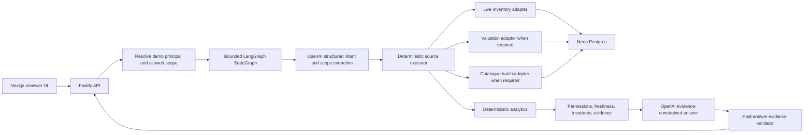

# AutoGrab Bounded Orchestrator POC - Same-Day Implementation Plan

Status: ready for execution  
Target: one working day  
Primary audience: engineering reviewers, hiring panel, and the implementation engineer

## 1. Executive summary

Build a reviewer-friendly proof of concept that demonstrates a bounded, evidence-backed AI workflow for dealership performance questions. The application will use AI only to interpret a question and explain validated facts. Permissions, data access, calculations, freshness decisions, evidence coverage, budgets, and failure handling remain deterministic TypeScript code.

The POC is deliberately a workflow rather than an open-ended tool-calling agent. It will have explicit LangGraph `StateGraph` nodes, a fixed state schema, conditional failure paths, a maximum request duration, and no recursive planning loop.

### Fixed technology choices

| Concern | Choice | Reason |
|---|---|---|
| Language | TypeScript | One language across web, API, workflow, contracts, and data access |
| Web application | Next.js App Router | Fast dashboard development and straightforward Vercel deployment |
| API | Fastify | Typed routes, validation hooks, structured logging, and direct Vercel support |
| Orchestration | `@langchain/langgraph` `StateGraph` | Explicit nodes, state, edges, budgets, and refusal paths |
| Runtime schemas | Zod | Pydantic is Python-only; Zod is the TypeScript equivalent and is supported by LangGraph and OpenAI structured outputs |
| Model API | OpenAI Responses API | Structured planner and answer outputs using Zod |
| Database | Neon Postgres | Hosted serverless Postgres suitable for both local development and Vercel |
| Data layer | Drizzle ORM + Neon HTTP driver | Typed schema, versioned migrations, and efficient one-shot serverless queries |
| Tests | Vitest + Fastify `inject`; Playwright smoke test if time permits | Fast unit/integration feedback with one visible end-to-end path |
| Package manager | pnpm workspaces | Lightweight monorepo without requiring an additional build orchestrator |

The OpenAI model must be configurable through `OPENAI_MODEL`. Start with `gpt-5.6-terra` for the POC's balance of intelligence and cost; allow `gpt-5.6-sol` when maximum planning quality is preferred. Do not embed model identifiers inside graph nodes.

## 2. Product goal and demo definition

The POC is successful when a reviewer can enter a supported dealership question and see:

1. The resolved user and dealership/region scope.
2. A small typed plan containing only supported intent and metric enums.
3. Which source adapters were called and which were skipped.
4. Deterministically calculated facts.
5. Source timestamps and freshness classifications.
6. Evidence IDs supporting the answer.
7. A qualified refusal when data is stale, scope is forbidden, or evidence is insufficient.

### Supported demo questions

| Intent | Example | Required sources | Demonstrates |
|---|---|---|---|
| Stock ageing | "Which vehicles at Sydney Central have been in stock over 60 days?" | Inventory | Scope resolution and deterministic ageing |
| Market pricing | "Which vehicles at Sydney Central are more than 10% above market?" | Inventory + valuation | Multi-source retrieval, join, and arithmetic |
| Regional model ageing | "Which Toyota models are ageing fastest in NSW?" | Inventory + catalogue | Lazy, batched catalogue lookup |
| Failure case | Repeat a market question with stale valuation data | Inventory + stale valuation | Fail-closed validation and a qualified no-answer |

### Explicitly unsupported in the POC

- Sales conversion, sales revenue, lead performance, or true salesperson performance. Current inventory only supports assigned stock, workload, and ageing; proper performance metrics require sales or CRM outcome data.
- Arbitrary SQL generated by the model.
- Write operations against inventory, valuation, catalogue, or customer data.
- Open-ended tool selection, recursive delegation, autonomous sub-agents, or long-term conversational memory.
- Production identity integration. The POC uses clearly labelled demo principals and still enforces their dealership scope in code.
- A production freshness SLA. POC thresholds are illustrative configuration requiring Product/data-owner agreement.

If time remains, add one historical snapshot question. Do not compromise the four core paths to add it.

## 3. Architecture

Use a pnpm monorepo with independently deployable frontend and API applications.

```text
apps/
  web/                       Next.js App Router UI
  api/                       Fastify API and Vercel entrypoint
packages/
  contracts/                 Shared Zod request/response/domain schemas
  db/                        Drizzle schema, Neon client, migrations, seed
  orchestrator/              LangGraph state, nodes, prompts, graph builder
  domain/                    Analytics, freshness, evidence, permissions
docs/
  ARCHITECTURE.md             Built-system explanation and diagram
  DECISIONS.md                Short ADR-style trade-offs
  BUILD_LOG.md                Phase gates, commands, results, deviations
```

Deploy the monorepo as two Vercel projects:

- `autograb-poc-web`, root directory `apps/web`
- `autograb-poc-api`, root directory `apps/api`

The browser calls the API through `NEXT_PUBLIC_API_BASE_URL`. Configure explicit CORS for only the local web origin and deployed web URL. This keeps Next.js and Fastify concerns visible and avoids an unnecessary proxy hop.



## 4. Request lifecycle and graph contract

### API contract

`POST /v1/query`

```json
{
  "question": "Which vehicles at Sydney Central are more than 10% above market?",
  "principalId": "head-office-analyst",
  "scenario": "normal"
}
```

`scenario` is an optional, clearly marked demo control with values such as `normal`, `stale-valuation`, `catalogue-timeout`, and `forbidden-site`.

The response should expose the workflow rather than returning only prose:

```json
{
  "requestId": "uuid",
  "status": "answered",
  "answer": { "summary": "...", "bullets": [], "caveats": [] },
  "resolvedScope": {},
  "plan": {},
  "metrics": [],
  "evidence": [],
  "sources": [],
  "validation": { "passed": true, "checks": [] },
  "timingsMs": {}
}
```

`status` is one of `answered`, `needs_clarification`, `refused`, or `failed`.

### StateGraph nodes

1. `initialiseRequest` - creates request ID, deadline, budgets, and trace metadata.
2. `interpretQuestion` - one OpenAI structured-output call producing supported intent, user-supplied scope terms, requested metric, and clarification need.
3. `resolveAndAuthoriseScope` - resolves names to database IDs and intersects them with the principal's allowed dealerships.
4. `buildExecutionPlan` - deterministic mapping from intent to approved source calls and required/optional evidence.
5. `executeSources` - enforces the six-call budget and uses `Promise.allSettled` for independent reads; catalogue lookup is lazy and batched.
6. `calculateFacts` - calculates counts, averages, ageing, price deltas, rankings, and distributions in TypeScript.
7. `validateFacts` - checks permissions, freshness, required sources, row completeness, invariants, and evidence coverage.
8. `composeAnswer` - asks OpenAI to express only the validated fact bundle using a structured answer schema; deterministic template fallback on model failure.
9. `validateAnswer` - rejects unknown evidence IDs, unsupported claims, or missing caveats.
10. `finalise` - returns the public response schema and persists an audit record.

Conditional edges route to `needsClarification` or `refuse` without calling downstream tools. Set a low recursion limit even though the graph contains no intentional loop.

### Core state fields

- Request: `requestId`, `question`, `principalId`, `scenario`, `startedAt`, `deadlineAt`.
- Budget: `maxToolCalls = 6`, `toolCallsUsed`, `maxPlannerAttempts = 2`.
- Interpretation: `intent`, `scopeTerms`, `filters`, `metric`, `needsClarification`.
- Security: `allowedDealershipIds`, `resolvedDealershipIds`, `authorised`.
- Execution: `plan`, `toolResults`, `toolErrors`, `timingsMs`.
- Facts: `metrics`, `evidence`, `sourceFreshness`, `invariantResults`.
- Output: `validation`, `answer`, `status`.

## 5. Data model and deterministic policies

### Minimum tables

| Table | Purpose |
|---|---|
| `regions` | Region lookup such as NSW and VIC |
| `dealerships` | Site identity and region membership |
| `demo_principals` | Named personas shown in the UI |
| `principal_dealerships` | Allowed site scope for each persona |
| `inventory` | Current stock, price, status, days-on-lot inputs, salesperson assignment, `vehicle_id`, source timestamps |
| `valuations` | Market value and segment benchmark with timestamps |
| `catalogue` | Make, model, badge, series, specifications, and source version keyed by `vehicle_id` |
| `agent_requests` | Audit summary: request, plan, status, model, duration, validation result |
| `agent_evidence` | Fact/evidence records linked to a request |

Use UTC `timestamptz` everywhere. Create indexes for dealership/status, region joins, vehicle IDs, source timestamps, and the common ageing/price filters.

Seed deterministic synthetic data using a fixed seed or SQL `generate_series`. Model the brief's scale with 50 dealerships and approximately 50,000 active inventory records. Keep the seed idempotent.

### Illustrative freshness policy

| Source | POC threshold | Behaviour |
|---|---|---|
| Inventory | 5 minutes | Required for every supported question; stale means refuse |
| Valuation | 60 minutes | Required for market-pricing intent; stale means refuse |
| Catalogue | Version-based | Required only for make/model/specification claims |

These numbers are demo defaults, not claimed business SLAs. Put them in typed configuration and display them in the UI.

### Invariants

- Counts are non-negative integers.
- Percentages and ratios use an explicitly documented range.
- No division by zero.
- The same dealership/region scope applies to every joined source.
- Source rows used in a metric pass the relevant freshness policy.
- Price delta is calculated in code from explicit inventory and valuation values.
- Rankings use a deterministic tie-breaker.
- Every material answer item references one or more evidence IDs.

## 6. Same-day phased SDLC plan

The estimates total roughly eight to nine focused hours. Stop adding features when a phase exceeds its timebox; preserve the working vertical slice.

### Phase 0 - Inception and environment gate (30 minutes)

Actions:

- Confirm Node.js and pnpm availability.
- Create `.env.example` without secrets.
- Record fixed scope, supported intents, and exclusions in `docs/DECISIONS.md`.
- Obtain or configure `DATABASE_URL`, `OPENAI_API_KEY`, `OPENAI_MODEL`, API/web origins, and demo freshness thresholds.
- Define the finish-line demo questions before coding.

Deliverables:

- Environment checklist.
- Initial decision record.
- No secrets committed.

Gate:

- The project can continue in deterministic mock-model mode if OpenAI credentials are unavailable.
- Database-dependent phases pause only if no Neon URL is available and no local Postgres fallback is permitted.

Reviewer narrative: constraints were made explicit before implementation, and unavailable credentials do not block non-LLM development.

### Phase 1 - Repository and contract skeleton (45 minutes)

Actions:

- Initialise pnpm workspaces and strict shared TypeScript configuration.
- Scaffold `apps/web`, `apps/api`, and the four packages.
- Add lint, format, typecheck, test, build, and development scripts at the root.
- Define shared Zod request, response, plan, fact, evidence, freshness, and validation schemas first.
- Add `/health` and `/ready` Fastify routes.

Deliverables:

- Both applications start locally.
- Shared contracts compile from both apps.
- Root commands work without hidden manual steps.

Gate:

- `pnpm lint`, `pnpm typecheck`, and `pnpm test` pass.
- Fastify `inject` test proves `/health` works.

Reviewer narrative: the public contract and boundaries precede feature code.

### Phase 2 - Neon schema, migrations, and deterministic seed (75 minutes)

Actions:

- Create Drizzle schema and committed SQL migration files.
- Build one idempotent seed command for regions, dealerships, demo principals, permissions, inventory, valuations, and catalogue.
- Add `db:migrate`, `db:seed`, and `db:refresh-freshness` scripts.
- Implement typed repository methods that always require an authorised scope object.
- Add query indexes and inspect representative query plans if time permits.

Deliverables:

- Repeatable database setup.
- Synthetic data with known edge cases: zero valuation, stale timestamps, ties, missing catalogue records.

Gate:

- Migration succeeds on an empty database.
- Seed is idempotent.
- Smoke queries return expected counts and never cross the supplied dealership scope.

Reviewer narrative: data provenance, scale, and permissions are testable rather than prompt instructions.

### Phase 3 - Deterministic domain and source adapters (75 minutes)

Actions:

- Implement principal/scope resolver.
- Implement inventory, valuation, and catalogue adapters returning one common typed envelope: `source`, `sourceTime`, `fetchedAt`, `freshness`, `rows`, and `evidenceRefs`.
- Implement the analytics functions for the three supported intents.
- Implement freshness rules, invariant checks, required/optional source logic, and evidence generation.
- Add scenario-based fault injection at the adapter boundary.

Deliverables:

- The supported questions can be answered from a hand-authored plan with no LLM.
- Every metric has stable evidence IDs.

Gate:

- Unit tests cover normal, stale, missing, forbidden, zero-denominator, and tie cases.
- Catalogue is not queried for inventory-only or valuation-only questions.

Reviewer narrative: the model is not a hidden calculation engine.

### Phase 4 - Bounded LangGraph and OpenAI integration (90 minutes)

Actions:

- Define graph state with LangGraph `StateSchema` and Zod.
- Implement the fixed nodes and conditional edges listed above.
- Use the OpenAI Responses API with `responses.parse` and a Zod format for question interpretation.
- Allow one retry only when the structured planner output is invalid; do not retry permission or freshness failures.
- Build the deterministic execution plan from approved enums rather than accepting tool names from the model.
- Implement answer composition from validated facts and a deterministic fallback renderer.
- Enforce deadline, tool-call, plan-step, row-limit, and recursion budgets.

Deliverables:

- A graph invocation returns the public response contract.
- A Mermaid or PNG graph is exported for `docs/ARCHITECTURE.md`.

Gate:

- Golden questions resolve to the expected intent, scope, tools, facts, and outcome.
- An ambiguous question routes to clarification.
- Stale required data and forbidden scope route to refusal.
- No raw database rows are placed in the answer prompt.

Reviewer narrative: AI is confined to typed interpretation and communication.

### Phase 5 - Fastify API and operational envelope (60 minutes)

Actions:

- Implement `POST /v1/query`, `GET /v1/demo/principals`, and `GET /v1/demo/scenarios`.
- Validate request and response payloads with shared Zod schemas.
- Add explicit CORS, request IDs, structured logs, safe error mapping, and per-request timeout handling.
- Persist the audit summary without storing secrets or model chain-of-thought.
- Return a consistent refusal response rather than an HTTP 500 for expected policy failures.

Deliverables:

- Stable API contract and OpenAPI output if supported by the selected Fastify plugins.

Gate:

- Fastify `inject` integration tests cover answer, clarification, refusal, validation error, and unexpected failure.
- Logs contain request ID, node durations, source ages, call counts, status, and model identifier.

Reviewer narrative: expected business refusals are different from system faults.

### Phase 6 - Next.js reviewer UI (60 minutes)

Actions:

- Build one dashboard page with question input, principal selector, sample-question buttons, and demo-scenario selector.
- Display status, answer, resolved scope, freshness badges, sources, evidence, validation checks, plan steps, and timings.
- Visually distinguish answered, clarified, refused, and failed outcomes.
- Add a concise architecture/about panel explaining the bounded design and demo limitations.
- Keep styling polished but secondary to trace visibility.

Deliverables:

- A reviewer can run the four demo paths without developer tools.

Gate:

- Keyboard-accessible controls, clear loading state, responsive layout, and no secret values in browser code.
- Browser network errors produce useful UI messages.

Reviewer narrative: the UI makes trust controls visible rather than hiding them behind fluent prose.

### Phase 7 - Verification, evaluation, and hardening (60 minutes)

Actions:

- Create at least 12 golden cases covering the three intents, ambiguity, authorisation, freshness, missing catalogue, and unsupported salesperson/CRM questions.
- Assert structured facts and outcomes rather than exact prose.
- Add tests for catalogue laziness, tool budget, deadline propagation, evidence references, and deterministic answer fallback.
- Run lint, typecheck, unit tests, integration tests, production builds, and one end-to-end smoke test.
- Capture p50/p95 latency from a small local replay and report model/database/tool time separately.

Deliverables:

- `docs/BUILD_LOG.md` contains the exact commands, results, known failures, and any scoped-out work.

Gate:

- Zero cross-dealership leakage in tests.
- All material answer items contain valid evidence references.
- All P0 checks pass; any P1 omission is documented.

Reviewer narrative: correctness is evaluated at the fact and policy layers, not by whether the prose sounds convincing.

### Phase 8 - Deployment, documentation, and rehearsal (45 minutes)

Actions:

- Deploy API and web as separate Vercel projects from the monorepo.
- Configure Vercel environment variables and the deployed CORS allowlist.
- Run database migrations once as an explicit release step, not during every request.
- Verify health, normal query, stale refusal, and forbidden-scope refusal in the deployed environment.
- Finalise `README.md`, `docs/ARCHITECTURE.md`, `docs/DECISIONS.md`, and `docs/BUILD_LOG.md`.
- Rehearse a five-minute demo and prepare answers to trade-off questions.

Deliverables:

- Working preview URLs if credentials and account access are available.
- Complete local run instructions if deployment is blocked.

Gate:

- A new reviewer can follow the README from clone to demo.
- No secrets, connection strings, or API keys appear in Git history, logs, or client bundles.

Reviewer narrative: deployment preserves the same contracts and failure behaviour verified locally.

## 7. Priority and time-cut rules

### P0 - must finish today

- Monorepo builds locally.
- Neon migration and seed are repeatable.
- Three supported intents work.
- Scope is enforced in repository queries.
- Metrics and validation are deterministic.
- One stale and one forbidden scenario refuse safely.
- UI exposes evidence, freshness, and validation.
- Tests and reviewer documentation exist.

### P1 - complete only after P0

- Deployed preview URLs.
- OpenAPI viewer.
- Playwright end-to-end automation.
- Historical snapshot question.
- Rich trace visualisation or streaming progress.
- Neon preview branches and automated CI deployment.

### P2 - explicitly defer

- Production authentication and database RLS integration.
- Live AutoGrab source integrations.
- Real observability vendor integration.
- Multi-agent workflows.
- Chat memory, write actions, or automated remediation.

## 8. Test and evaluation matrix

| Layer | What to test | Representative assertion |
|---|---|---|
| Contracts | Zod request/response schemas | Invalid scenario or empty question is rejected |
| Permissions | Principal/site resolution | Site outside allowed set returns `refused` and no rows |
| Adapters | Source envelopes and errors | Every result includes timestamps and source identity |
| Analytics | Counts, averages, deltas, rankings | Golden fixtures produce exact numeric facts |
| Freshness | Per-source thresholds | Stale required valuation blocks market-pricing answer |
| Graph | Node routing and budgets | Ambiguity never reaches source execution |
| Evidence | Fact-to-answer mapping | Every answer evidence ID exists in returned evidence |
| API | Status and error mapping | Expected refusal remains a structured 200 response |
| UI | Reviewer workflow | Four demo paths are runnable and visibly distinct |
| Deployment | Environment and CORS | Only configured web origin can call deployed API |

Do not evaluate exact answer wording. Evaluate structured intent, resolved scope, required tools, metric values, source timestamps, validation checks, evidence coverage, and final status.

## 9. Security, privacy, and failure controls

- Keep `OPENAI_API_KEY` and `DATABASE_URL` only in API/server environments.
- Never use `NEXT_PUBLIC_` for secrets.
- Treat the demo principal selector as simulated identity and label it as such.
- Resolve and authorise scope before data retrieval; push authorised IDs into every database query.
- Use parameterised Drizzle queries only.
- Never pass raw unrestricted inventory rows to OpenAI; pass compact facts and evidence labels.
- Use request-level `AbortController`/deadline propagation and a hard overall timeout.
- Cap rows, tool calls, planner attempts, evidence count, and response length.
- Log metadata and facts needed for audit, not secrets or hidden model reasoning.
- Distinguish policy refusals, partial optional-source failures, and unexpected system errors.

## 10. Definition of done

The POC is complete when all of the following are true:

- A clean clone can install, migrate, seed, start, and test using documented commands.
- All code is strict TypeScript with shared runtime schemas.
- The graph topology is bounded and visible in documentation.
- The model cannot select arbitrary tools, run SQL, calculate metrics, or expand scope.
- The three supported intents return correct facts from deterministic fixtures.
- Unsupported salesperson conversion questions are refused or clearly narrowed.
- Stale critical data, forbidden scope, failed invariants, and missing evidence fail closed.
- The UI shows scope, timestamps, evidence, validation, and timings.
- P0 test/build commands pass.
- Deployment status and any remaining limitations are honestly documented.

## 11. Reviewer walkthrough

Use this five-minute sequence:

1. Show the graph and state contract: fixed workflow, no recursive agent loop.
2. Ask an inventory-only ageing question and point out that valuation and catalogue were skipped.
3. Ask a market-pricing question and show deterministic price-delta facts with both source timestamps.
4. Ask a model-level regional question and show the batched catalogue lookup.
5. Toggle stale valuation and demonstrate a qualified refusal.
6. Switch to a site-limited principal and ask for a forbidden site.
7. Finish with the tests and build log that prove facts, evidence, and permissions independently of prose.

## 12. Reference basis

- [LangGraph JavaScript Graph API](https://docs.langchain.com/oss/javascript/langgraph/use-graph-api) - Zod-backed state, conditional edges, parallel execution, retries, recursion limits, and graph visualisation.
- [OpenAI structured outputs](https://developers.openai.com/api/docs/guides/structured-outputs) - JavaScript Zod parsing through the Responses API.
- [OpenAI text generation](https://developers.openai.com/api/docs/guides/text?api-mode=responses) - Responses API guidance.
- [OpenAI model catalogue](https://developers.openai.com/api/docs/models) - current model family and cost/intelligence trade-offs.
- [Fastify Type Providers](https://fastify.dev/docs/latest/Reference/Type-Providers/) - typed schema inference and Zod support.
- [Fastify on Vercel](https://vercel.com/docs/frameworks/backend/fastify) - direct Vercel deployment and entrypoint conventions.
- [Next.js App Router](https://nextjs.org/docs/app) - frontend project conventions.
- [Neon serverless driver](https://neon.com/docs/serverless/serverless-driver) - JavaScript/TypeScript serverless Postgres access.
- [Drizzle with Neon](https://orm.drizzle.team/docs/get-started/neon-new) - typed Neon connection, schema, and migrations.

